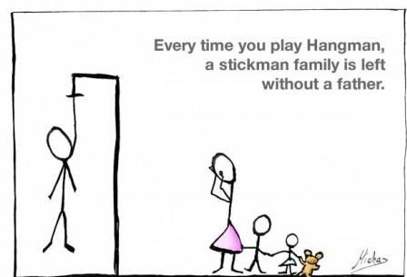

# 🧍 Hangman Game

- This is a Python implementation of the classic Hangman game.

   

## 📄 Description

- The Hangman game allows a player to guess letters in order to uncover a hidden word. With each incorrect guess, a part of a gallows and victim is drawn. The game ends either when the player guesses the word correctly or when the gallows and victim drawing is completed.

## 🕵️‍♂️ Features

- Randomly selects a secret word from a predefined list.
- Tracks the number of lives left.
- Displays the current state of the guessed word.
- Visual representation of the hangman as the game progresses.
- Handles invalid inputs and repeated guesses.

## ▶️ How to Play

### 🛠️ Setup:

- The game starts by selecting a random word from a list of predefined words.

## 🎮 Gameplay

1. The player enters a letter as a guess.
2. If the letter is in the secret word, it is revealed in its correct positions.
3. If the letter is not in the secret word, the player loses a life and part of the hangman is drawn.
4. The game continues until either the player guesses the entire word correctly or runs out of lives.

## 🎉 End of the Game:

5. If the player guesses the word correctly, a "Congratulations" message is displayed.
6. If the player runs out of lives, a "Game Over" message is displayed with the secret word revealed.

## 🧩 Game Components

### 🎈`HangmanGame` Class

- `__init__(self, secret_word, lives_left)`: Initializes the game with a secret word and number of lives.
- `assess_guess(self, guessed_letter)`: Checks if the guessed letter is in the secret word and updates lives accordingly.
- `get_guess(self)`: Prompts the user to enter a guess, validates the input, and returns the guess.
- `draw_hangman(self)`: Draws the current state of the hangman based on the number of lives left.

### 🎈`HangmanGame_Display` Class

- `display(secret_word, suggested_letters)`: Static method that returns the current display state of the secret word, showing guessed letters and underscores for remaining letters.

### 🎈`play_game` Function

- Initializes the game and runs the main game loop, managing the game state and user interaction.

## 🚀 Getting Started

### 🌟 Running the Game

#### 🏁 Installation

1. Clone this repository or copy the source code to your local machine.
   `git clone <repository-url>`
2. Open a terminal and navigate to the directory containing the source code.
   `cd HangmanGame`
3. Run the game with the command:
   `python hangman.py`

   

